# 🏥 MedQuery AI — Corrective RAG System for Clinical QA

> **Production-grade Corrective Retrieval-Augmented Generation (CRAG) pipeline for medical question answering, built with LangGraph, Groq (Llama 3.1), ChromaDB, and Streamlit.**

[](https://python.org)
[](https://langchain-ai.github.io/langgraph/)
[](https://console.groq.com)
[](https://streamlit.io)
[](https://www.trychroma.com/)

---

## 📌 Problem Statement

Standard LLMs hallucinate — they confidently generate incorrect medical facts (wrong dosages, wrong drug interactions, wrong thresholds). In healthcare, this is **life-threatening**.

Basic RAG systems simply retrieve documents and feed them to an LLM with **no quality checks**:
- ❌ Retrieves irrelevant documents → still generates an answer
- ❌ No verification that the answer matches the retrieved context
- ❌ No fallback when the local knowledge base doesn't have the answer

**MedQuery AI solves this** with a **Corrective RAG (CRAG)** pipeline that grades documents, rewrites queries, falls back to web search, and verifies every answer for hallucination before returning it.

---

## 🏗️ System Architecture

### CRAG Pipeline Flow
<p align="center">
  
</p>

```
┌───────────────────────────────────────────────────────────────────┐
│                     DATA INGESTION (ingest.py)                    │
│  PDF Files (data/) → PyPDFDirectoryLoader → 637 pages             │
│  → RecursiveCharacterTextSplitter (500 chars, 50 overlap)         │
│  → 5,961 chunks → all-MiniLM-L6-v2 → ChromaDB (persisted)        │
└───────────────────────────────────────────────────────────────────┘
                              │
                              ▼
┌───────────────────────────────────────────────────────────────────┐
│                    CRAG LANGGRAPH PIPELINE                        │
│                                                                   │
│   ① RETRIEVE    → k-NN similarity search in ChromaDB (k=5)       │
│   ② GRADE       → LLM grades each doc: RELEVANT / IRRELEVANT     │
│   ③ ROUTE       → Conditional edge decides next step              │
│   ④ TRANSFORM   → LLM rewrites query with clinical terminology   │
│   ⑤ WEB SEARCH  → Tavily API fallback (3 web results)            │
│   ⑥ GENERATE    → Groq Llama 3.1 generates grounded answer       │
│   ⑦ HALL CHECK  → LLM verifies every claim is context-grounded   │
└───────────────────────────────────────────────────────────────────┘
                              │
                              ▼
┌───────────────────────────────────────────────────────────────────┐
│                     STREAMLIT FRONTEND                            │
│   Query Interface · Pipeline Trace · Metrics Dashboard · History  │
└───────────────────────────────────────────────────────────────────┘
```

### Corrective Routing Logic

```
Query → RETRIEVE → GRADE DOCS → [CONDITIONAL ROUTE]
                                  ├─ ALL RELEVANT    → GENERATE → HALLUCINATION CHECK → ✅ Answer
                                  ├─ MIXED RELEVANCE → TRANSFORM QUERY → RE-RETRIEVE → GENERATE
                                  └─ ALL IRRELEVANT  → WEB SEARCH (Tavily) → GENERATE
```

---

## 📁 Project Structure

```
MedQuery-AI-Corrective-RAG-System-for-Clinical-QA/
├── Notebook/
│   └── medical_crag.ipynb        # Full CRAG pipeline development + evaluation
├── data/
│   └── Medical_book.pdf          # Source medical textbook (637 pages)
├── chroma_medical_db/            # Persisted ChromaDB vector store
├── streamlit_app.py              # Production Streamlit frontend (952 lines)
├── ingest.py                     # PDF ingestion → ChromaDB indexing script
├── crag_pipeline.svg             # Architecture diagram (shown in app)
├── requirements.txt              # Python dependencies
├── .env                          # API keys (GROQ, TAVILY, LANGSMITH)
├── crag_evaluation_results.csv   # Per-query Naive RAG vs CRAG comparison
├── crag_summary_metrics.csv      # Aggregated evaluation metrics
└── README.md
```

---

## 🚀 Quick Start

### 1. Clone & Create Virtual Environment
```bash
git clone https://github.com/Satya-Mohapatro/MedQuery-AI-Corrective-RAG-System-for-Clinical-QA.git
cd MedQuery-AI-Corrective-RAG-System-for-Clinical-QA

python -m venv medibot
# Windows:
medibot\Scripts\activate
# Linux/Mac:
source medibot/bin/activate

pip install -r requirements.txt
```

### 2. Set API Keys
Create a `.env` file in the project root:
```env
GROQ_API_KEY=your_groq_key          # Free at https://console.groq.com
TAVILY_API_KEY=your_tavily_key      # Free at https://tavily.com
LANGSMITH_API_KEY=your_key          # Optional — https://smith.langchain.com
LANGCHAIN_TRACING_V2=true
LANGCHAIN_PROJECT=MedQuery-CRAG
```

### 3. Ingest Medical Documents
```bash
python ingest.py
```
This processes all PDFs in `data/`, chunks them, embeds with `all-MiniLM-L6-v2`, and stores in `chroma_medical_db/`.

### 4. Run the Streamlit App
```bash
streamlit run streamlit_app.py
```
Open `http://localhost:8501` in your browser.

### 5. (Optional) Run the Jupyter Notebook
```bash
jupyter notebook Notebook/medical_crag.ipynb
```

---

## 🧠 Core Concepts

### Corrective RAG (CRAG)
Unlike basic RAG which blindly feeds retrieved docs to an LLM, CRAG adds **self-correction loops**:

| Scenario | What CRAG Does |
|---|---|
| All retrieved docs are relevant | Directly generate the answer |
| Mixed relevance (some irrelevant) | **Transform the query** with clinical terminology → re-retrieve |
| All docs irrelevant | **Fall back to web search** (Tavily API) |
| Answer has ungrounded claims | **Hallucination detected** → re-route to web search |
| Retry limit reached (≥2) | Generate with best available context (circuit breaker) |

### LangGraph Stateful Pipeline
The pipeline is implemented as a **LangGraph StateGraph** — a directed graph where:
- **Nodes** = processing functions (retrieve, grade, generate, etc.)
- **Edges** = transitions between nodes
- **Conditional Edges** = routing decisions based on grading results
- **State** = a shared `TypedDict` carrying data across all nodes

### LLM-as-Judge
The Groq LLM evaluates each retrieved document's relevance by returning structured JSON:
```json
{"relevance": "RELEVANT", "reason": "Document addresses metformin dosage directly"}
```

### Hallucination Detection
After generation, the LLM verifies its own answer against the source context:
```json
{"verdict": "grounded", "confidence": 0.95, "ungrounded_claims": []}
```

---

## 🔵 Pipeline Nodes

| Node | Purpose | Details |
|---|---|---|
| **① RETRIEVE** | Similarity search | ChromaDB k-NN with `all-MiniLM-L6-v2` embeddings (k=5) |
| **② GRADE DOCUMENTS** | Relevance scoring | Groq LLM classifies each doc: `RELEVANT` / `IRRELEVANT` / `AMBIGUOUS` |
| **③ ROUTE** | Conditional edge | Routes to generate, transform, or web search based on grades |
| **④ TRANSFORM QUERY** | Query rewriting | Groq rewrites with precise clinical terminology, then re-retrieves |
| **⑤ WEB SEARCH** | External fallback | Tavily API returns 3 medical web results as Documents |
| **⑥ GENERATE** | Answer synthesis | Groq Llama 3.1 generates answer using ONLY provided context + sources |
| **⑦ HALLUCINATION CHECK** | Verification | Groq verifies every claim in the answer is grounded in context |

---

## 📊 Evaluation Metrics

| Metric | Formula | What It Measures |
|---|---|---|
| **Recall@5** | `relevant_hits / docs_retrieved` | Were the right docs in the top 5? |
| **Faithfulness** | `answer_words ∩ context_words / answer_words` | Does the answer stay faithful to context? |
| **Answer Relevance** | `cosine_similarity(embed(question), embed(answer))` | Is the answer semantically related to the question? |
| **Hallucination Rate** | `0.0 if grounded, 1.0 if not` | Did the hallucination check pass? |

### Naive RAG vs CRAG Comparison

| Metric | Naive RAG | CRAG | Improvement |
|---|---|---|---|
| Recall@5 | ~70% | ~85% | +15% |
| Faithfulness | ~65% | ~82% | +17% |
| Hallucination Rate | ~25% | ~8% | **-17%** |
| Answer Relevance | 0.74 | 0.86 | +0.12 |

---

## 🛠️ Tech Stack

| Category | Technology | Purpose |
|---|---|---|
| **LLM** | Groq API — Llama 3.1 8B Instant | Fast, free-tier inference for grading, generation, verification |
| **Orchestration** | LangGraph | Stateful agentic pipeline with conditional routing |
| **Framework** | LangChain Core | Prompts, chains, output parsers, document loaders |
| **Embeddings** | `all-MiniLM-L6-v2` (384-dim) | Sentence Transformer model for semantic similarity |
| **Vector Store** | ChromaDB (local, persistent) | Stores and retrieves document embeddings |
| **Web Fallback** | Tavily Search API | Medical web search when local KB is insufficient |
| **Document Processing** | PyPDF + RecursiveCharacterTextSplitter | PDF loading, 500-char chunking with 50-char overlap |
| **Frontend** | Streamlit | Interactive web UI with tabs, metrics, and history |
| **Observability** | LangSmith | Full tracing of every LLM call and pipeline step |
| **Environment** | python-dotenv | Secure API key management |

---

## 💻 Streamlit Frontend Features

- **🔍 Query Interface** — Text input + 8 pre-built example clinical questions
- **🔀 Pipeline Trace** — Color-coded badges showing the exact path taken (RETRIEVE → GRADE → GENERATE, etc.)
- **💊 Clinical Answer** — Styled answer box with source citations
- **✅ Hallucination Verdict** — Grounded/Not Grounded with confidence percentage
- **📋 Document Grading** — Expandable view of each retrieved doc's relevance label and reason
- **📊 Live Metrics** — Recall@5, Faithfulness, Answer Relevance, Hallucination Rate cards
- **📜 Session History** — Full history of all queries with metrics
- **📤 PDF Upload** — Upload new medical PDFs and index them into ChromaDB on the fly
- **🏗️ Architecture** — SVG pipeline diagram + metric formulas + tech stack overview

---

## 🔑 API Keys Required

| Service | Free Tier | Get Key |
|---|---|---|
| **Groq** | 14,400 requests/day | [console.groq.com](https://console.groq.com) |
| **Tavily** | 1,000 requests/month | [tavily.com](https://tavily.com) |
| **LangSmith** | Free (optional) | [smith.langchain.com](https://smith.langchain.com) |

---

## 📜 License

This project is for educational purposes as part of a Mini Project in Generative AI.

---

<p align="center">
  Built with ❤️ using LangGraph + Groq + ChromaDB + Streamlit
</p>
